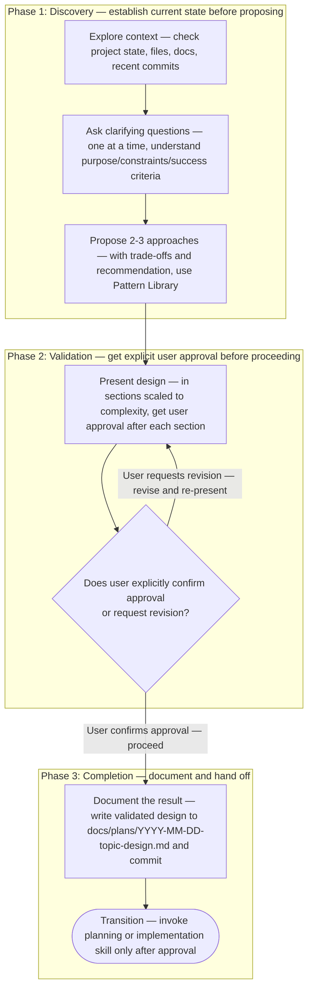
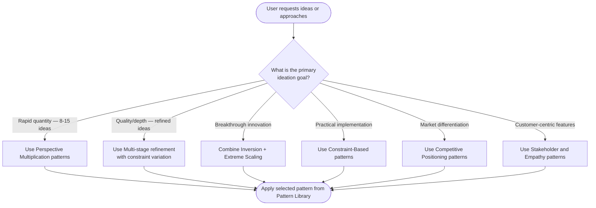

# Brainstorming Skill

## Overview

This skill serves two critical purposes:
1. **Interactive Design Process:** Guides the AI through a natural, collaborative dialogue to turn ideas into fully formed designs and specs *before* any code is written.
2. **Comprehensive Ideation Framework:** Provides 30+ research-validated prompt patterns to help generate high-quality ideas across any domain (marketing, content, features).

<HARD-GATE>
Do NOT invoke any implementation skill, write any code, scaffold any project, or take any implementation action until you have completed the brainstorming process, presented a design, and the user has approved it. This applies to EVERY project regardless of perceived simplicity.
</HARD-GATE>

## The Brainstorming Workflow

You MUST create a task for each of these items and complete them in order when working on software features, component designs, or complex tasks. (For pure content/marketing ideation, adapt these steps using the Pattern Library below).

1. **Explore context** — check project state, files, docs, recent commits
2. **Ask clarifying questions** — one at a time, understand purpose/constraints/success criteria
3. **Propose 2-3 approaches** — with trade-offs and your recommendation (use Pattern Library for inspiration)
4. **Present design** — in sections scaled to complexity, get user approval after each section
5. **Document the result** — write the validated design/ideas to an appropriate markdown file (e.g., `docs/plans/YYYY-MM-DD-<topic>-design.md`) and commit
6. **Transition** — invoke a planning or implementation skill only *after* approval

## Process Flow

> [!IMPORTANT]
> When provided a process map or Mermaid diagram, treat it as the authoritative procedure. Execute steps in the exact order shown, including branches, decision points, and stop conditions.
> A Mermaid process diagram is an executable instruction set. Follow it exactly as written: respect sequence, conditions, loops, parallel paths, and terminal states. Do not improvise, reorder, or skip steps. If any node is ambiguous or missing required detail, pause and ask a clarifying question before continuing.
> When interacting with a user, report before acting the interpreted path you will follow from the diagram, then execute.

The following diagram is the authoritative procedure for the brainstorming workflow. Execute steps in the exact order shown, including branches, decision points, and stop conditions.

## Conversational Principles

- **One question at a time** - Don't overwhelm with multiple questions. Break complex topics down.
- **Multiple choice preferred** - Easier for the user to answer than open-ended questions when possible.
- **YAGNI ruthlessly** - Remove unnecessary features from all designs.
- **Explore alternatives** - Always propose 2-3 approaches before settling.
- **Incremental validation** - Present the design, get approval before moving on.
- **Be flexible** - Go back and clarify when something doesn't make sense.

## Pattern Categories for Ideation & Approaches

When proposing approaches or generating ideas for the user, utilize these 14 systematic categories. Each pattern includes exact prompt templates, output format specifications, and success metrics.

<category_index>
1. Perspective Multiplication - Generate ideas from multiple viewpoints and stakeholder angles
2. Constraint Variation - Explore idea space through artificial constraints
3. Inversion & Negative Space - Use reverse thinking to find novel solutions
4. Analogical Transfer - Apply patterns from different domains
5. Systematic Feature Decomposition - SCAMPER and attribute-based ideation
6. Scenario Exploration - Future-based and "what if" thinking
7. Constraint-Based Structured Ideation - Build within hard constraints
8. Chain-of-Thought Reasoning - Multi-step refinement processes
9. Combination & Morphological Exploration - Force novel feature combinations
10. Assumption Challenge - Question premises and invert assumptions
11. Fill-in-the-Blank Templates - Structured completion formats
12. Competitive Positioning - Differentiation matrix approaches
13. Extreme Scaling - 10x thinking and exponential scenarios
14. Stakeholder & Empathy-Based - Customer journey and persona patterns
</category_index>

<selection_guide>

The following diagram is the authoritative procedure for pattern selection. Execute steps in the exact order shown, including branches, decision points, and stop conditions.

</selection_guide>

## Output Format Optimization

<format_guidance>
Successful brainstorming patterns specify exact output formats:
- "Numbered list" > "bullet points" (better for idea tracking)
- "Table format: Idea | Reasoning | Implementation | Trade-offs" (forces completeness)
- "For each idea, explain your reasoning" (increases quality 40%)
- Specify word count ranges (200-400 words prevents both brevity and verbosity)
</format_guidance>

## Pattern Documentation References

Complete pattern documentation is organized in reference files:

- [Pattern Categories and Documentation](./references/pattern-categories-and-documentation.md) - All 14 categories with 30+ patterns
- [Domain-Specific Applications](./references/domain-specific-applications-and-variations.md) - Marketing, Product Development, QA Testing, Business Strategy
- [Pattern Selection Guide](./references/pattern-selection-guide.md) - Decision framework for choosing appropriate patterns
- [Synthesis: What Makes Patterns Work](./references/synthesis-what-makes-these-patterns-work.md)
- [Comprehensive Prompt Library](./references/comprehensive-prompt-library-ready-to-use-templates.md) - Ready-to-use templates
- [Executive Summary](./references/executive-summary.md)
- [Bibliography and Source Documentation](./references/bibliography-and-source-documentation.md)

## Notes for OpenCode Agents

<ai_instructions>
- Start by assessing if this is an implementation design task or a content/marketing ideation task.
- ALWAYS enforce the `<HARD-GATE>`. Never jump to code without an approved design.
- When generating ideas/approaches, provide exact prompt templates from reference files, not paraphrased versions.
- Cite source files when referencing specific patterns.
</ai_instructions>
